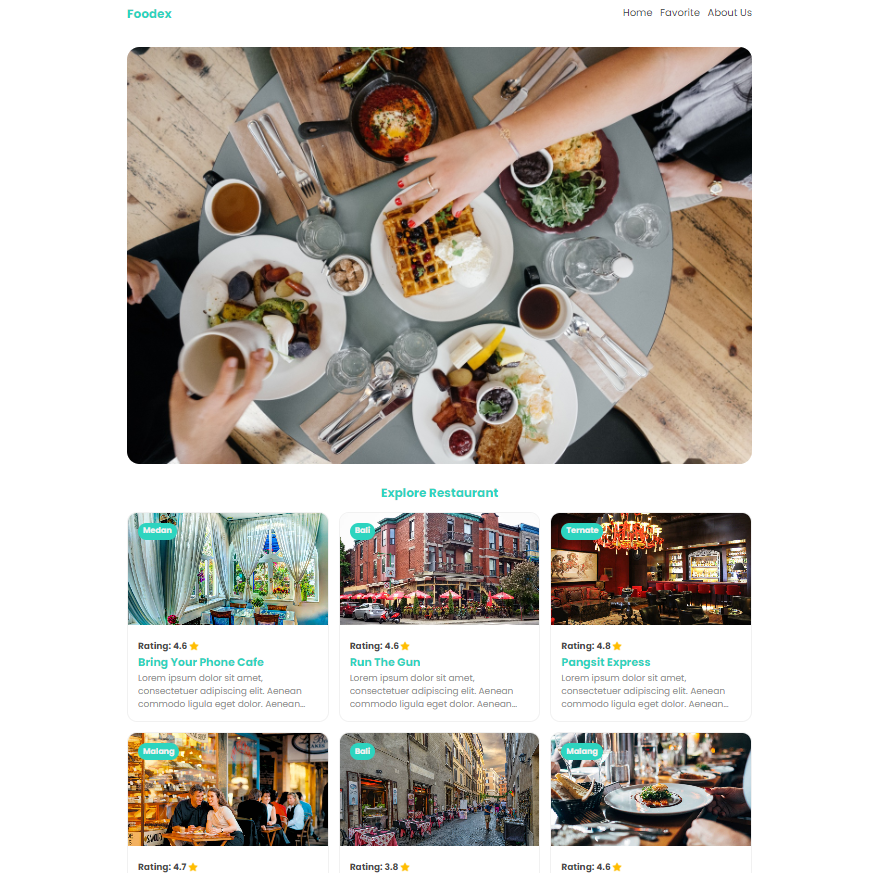

## Submission: Katalog Restoran

| Field | Information |
|---|---|
| Student Name | I KOMANG GEDE APRIANA (gedeapriana) |
| Submission ID | 2961493 |
| Course | [Menjadi Front-End Web Developer Expert](https://www.dicoding.com/academies/163) |
| Dikirim pada | 	04-Apr-2024 01:44:23 |
| Submission | [Submission: Katalog Restoran](https://www.dicoding.com/academies/219/tutorials/9301) |
| Tipe | Token: SIB Cycle 6 Cohort - FEBE |
| Stars |  |

Anda telah belajar hal-hal berikut.

- Menerapkan dasar responsibilitas tampilan pada perangkat seluler (Implementing Small Things).
- Menerapkan layout yang responsif menggunakan @media query dan grid css (Implementing Responsive Layout).
- Optimisasi elemen UI seperti menerapkan navigation drawer, dan menetapkan jarak teks yang sesuai (Other Optimization).
- Menggunakan focus dan screen reader untuk menginput data di website (Experiencing Focus & Experiencing Screen Reader).
- Untuk mempelajari modul berikutnya, kirimkan proyek aplikasi web dengan tema Katalog Restoran. Aplikasi memiliki satu halaman statis yang menampilkan daftar restoran sesuai dengan data yang diberikan.

Untuk mempelajari modul berikutnya, kirimkan proyek aplikasi web dengan tema Katalog Restoran. Aplikasi memiliki satu halaman statis yang menampilkan daftar restoran sesuai dengan data yang diberikan.

## Kriteria
- [x] App Bar (Navigation Bar)
- [x] ero Element (Jumbotron Element)
- [x] Daftar Restoran
- [x] Footer
- [x] Responsibilitas Tampilan (menggunakan grid, flexbox)
- [x] Aksesibilitas Website

## Kriteria Opsional
- [x] Menerapkan tampilan aplikasi yang menarik
- [x] Terdapat konten tambahan yang relevan dengan tema aplikasi atau di luar dari data yang disediakan. (dalam hal ini, data yang ditambahkan berupa kategori dari makanan)
- [x] Menggunakan elemen secara bijak sesuai dengan fungsinya
- [x] Telah menggunakan css preprocessor (SASS)